# Latest Workflow Orchestration Tools Compilation (Including Multi-Platform Comparison)

Managing client projects means juggling scattered emails, missed deadlines, document chaos, and endless follow-ups across multiple platforms. Workflow orchestration tools consolidate everything—client communication, file sharing, task tracking, e-signatures, and process automation—into one central hub where both your team and clients work together seamlessly. The right client portal eliminates communication friction, accelerates project timelines, and delivers professional experiences that strengthen relationships while keeping sensitive information secure.

## **[Moxo](https://www.moxo.com)**

Complete workflow orchestration platform balancing automation with human-driven processes.

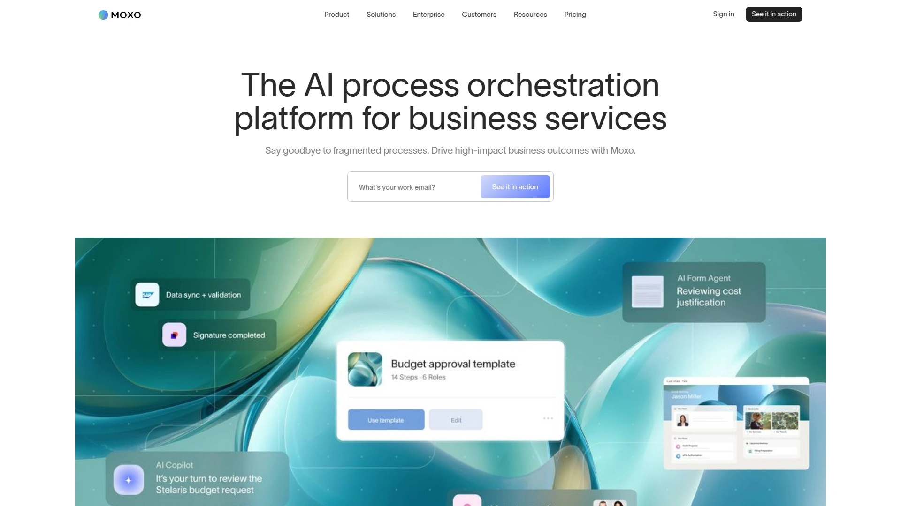

Moxo orchestrates human-driven workflows by determining when tasks run automatically and when they require human review, ensuring efficiency without sacrificing quality control. The platform advances processes instantly when clients upload files or managers approve work, eliminating momentum-killing delays that pile up with manual handoffs. Agentic AI reviews forms, routes work to appropriate team members, and clarifies next steps so nothing gets stuck waiting for guidance.

Seamless integrations connect to your CRM, ERP, transaction systems, and core business applications so workflows flow across the tools your team already relies on. Every stakeholder—clients, vendors, internal teams—gets one clear place to complete tasks, share files, and track progress without switching platforms or hunting through email threads. Comprehensive audit logs, flexible deployment options, SSO/SAML, encryption, and enterprise-grade security features ensure compliance and data protection.

**Client portal capabilities** provide branded spaces where external parties collaborate on projects without accessing internal systems. Document sharing, secure messaging, e-signatures, and task lists centralize everything clients need while maintaining professional boundaries. The platform particularly suits professional services firms, financial institutions, healthcare providers, and any organization managing complex multi-step processes involving external stakeholders.

Moxo transforms scattered client interactions into structured workflows where accountability stays clear and progress remains visible. Teams managing onboarding sequences, approval chains, or compliance-heavy processes benefit from the balance between automation efficiency and human oversight.

## **[Zendesk](https://www.zendesk.com)**

AI-powered customer service platform with comprehensive client portal and ticketing systems.

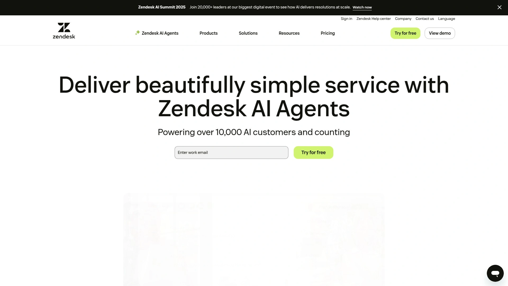

Zendesk delivers enterprise-grade client portal functionality embedded within a full customer service ecosystem featuring ticketing, knowledge base, and multi-channel support. Clients track support tickets, access past interactions, and find self-service resources without contacting support teams directly. AI capabilities automate routine inquiries, route complex issues to appropriate agents, and surface relevant knowledge base articles based on customer questions.

The platform's strength lies in handling high support volumes across email, chat, phone, and social media channels while maintaining context across conversations. Customizable portal designs match your brand while providing intuitive interfaces that customers navigate without training. Analytics dashboards reveal support patterns, agent performance, and customer satisfaction trends that inform service improvements.

**Integration ecosystem** connects to hundreds of business tools through native connectors and robust API access. Multi-language support accommodates global customer bases without fragmenting your support infrastructure. The platform particularly suits businesses with significant customer support needs rather than simple project collaboration scenarios.

Pricing reflects enterprise positioning—smaller teams might find costs high relative to simpler portal solutions, but support-centric organizations justify the investment through efficiency gains and customer satisfaction improvements. Zendesk works best when support ticket management drives your client interaction model rather than project-based workflows.

## **[ShareFile](https://www.sharefile.com)**

Secure document sharing portal emphasizing compliance and regulated industry requirements.

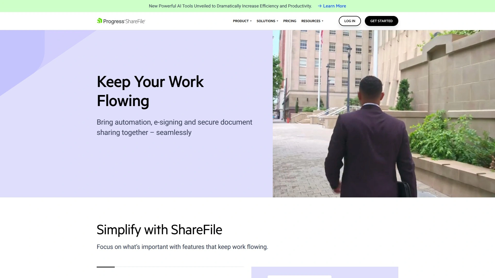

ShareFile specializes in secure file transfer for healthcare, legal, financial services, and other regulated industries requiring HIPAA, GDPR, or SOC 2 compliance. Documents, files, and messages receive encryption both in transit and at rest, with granular access controls ensuring only authorized users view sensitive information. Virtual data rooms handle large-scale document sharing like M&A transactions or legal discovery where hundreds of files require secure organized access.

Built-in alerts, comments, and task tracking cut delays by showing clients exactly what to submit, sign, or share. Automated notifications keep projects moving without constant manual follow-ups, accelerating service delivery timelines. E-signature integration lets clients sign documents directly within the portal rather than printing, scanning, or using separate tools.

**Mobile and web access** ensures clients interact with your portal anytime from any device without installing specialized software. Custom branding applies your logo and colors so the portal reinforces your brand identity rather than appearing generic. Workflow automation routes documents through approval chains or triggers actions based on file uploads.

ShareFile particularly suits professional services firms handling confidential client information where security breaches carry significant legal and reputational risks. The platform's compliance features and audit trails satisfy regulatory requirements that generic file-sharing tools cannot meet.

## **[Copilot](https://www.copilot.app)**

Client-focused platform designed specifically for service businesses and freelancers.

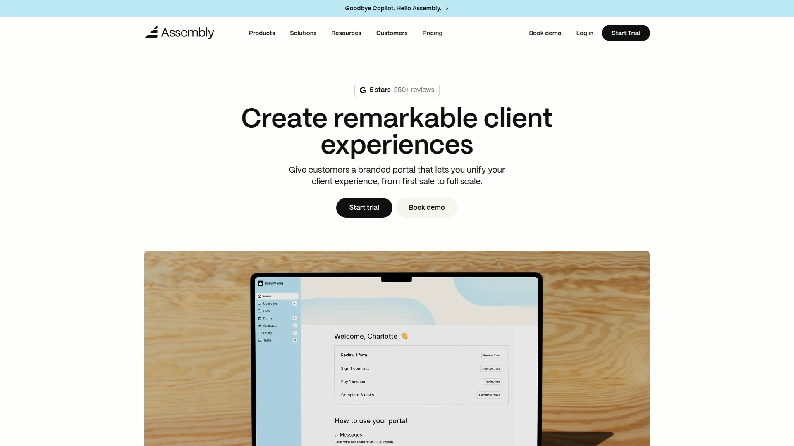

Copilot centers on client experience with branded portals, integrated billing, and streamlined communication tools that professional service providers need daily. The platform makes portal navigation intuitive for clients who may not be technically sophisticated, reducing support burden on your team. Secure file sharing, project updates, invoice delivery, and payment collection happen in one location clients bookmark and return to.

Billing integration handles estimates, invoices, and payment processing without switching to accounting software. Time tracking capabilities log billable hours that flow directly into client invoices, ensuring accurate billing without manual transcription. Project timelines and milestone tracking keep clients informed about progress while managing expectations around deliverables.

**Mobile-first design** ensures clients easily interact through smartphones rather than requiring desktop access. Quick setup gets portals running in hours rather than weeks of configuration, important for small teams without dedicated IT resources. Templates provide starting points for common service business workflows like onboarding, project kickoff, or deliverable review.

Pricing starts accessibly for freelancers and scales reasonably as teams grow. Copilot particularly suits consultants, agencies, coaches, and other service providers where client-facing polish and financial tools matter more than complex internal project management.

## **[Accelo](https://www.accelo.com)**

Comprehensive client lifecycle management integrating CRM, projects, billing, and support.

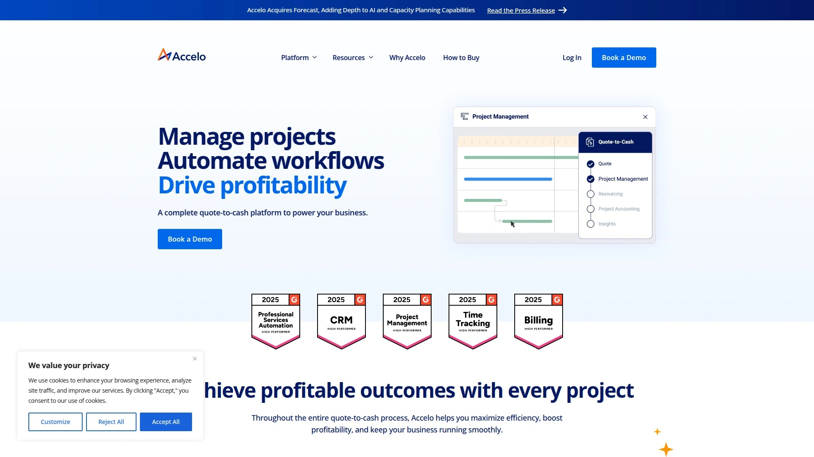

Accelo manages the entire client journey from initial contact through project delivery, billing, and ongoing support within unified platform. CRM functionality tracks leads, opportunities, and sales pipelines while seamlessly transitioning won deals into active projects. Time tracking captures billable hours automatically, generating invoices that reflect actual work performed rather than estimates.

Resource planning tools balance workload across team members, preventing overallocation while identifying available capacity for new projects. Automation streamlines repetitive tasks like status updates, approval requests, or deadline reminders without manual intervention. Client portal provides customers visibility into project status, invoices, and support tickets from their perspective.

**Comprehensive business intelligence** consolidates data across sales, delivery, and financials to reveal profitability by client, project type, or service line. Integration capabilities connect to accounting systems, ensuring financial data synchronizes without duplicate entry. The platform particularly suits professional services firms running multiple simultaneous client engagements where profitability tracking matters.

Learning curve exists—teams need time to configure workflows and train staff on the comprehensive feature set. Accelo works best for established service businesses ready to invest in end-to-end client management rather than point solutions for individual needs.

## **[SuiteDash](https://suitedash.com)**

All-in-one white-label business software for agencies managing multiple client relationships.

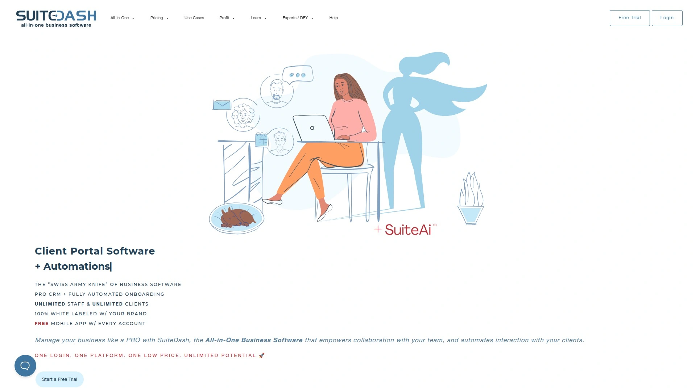

SuiteDash provides white-label client portals, CRM, project management, file sharing, invoicing, and team collaboration within a single fully-brandable platform. Remove SuiteDash branding entirely and present portals under your own domain and visual identity, creating seamless brand experiences. Dynamic logic engine enables conditional workflows that adapt based on client responses, routing users through personalized journeys.

Client onboarding sequences use kickoff forms that auto-progress prospects through defined steps without manual intervention. File requests prompt clients to upload specific documents, while shared folders provide organized spaces for project assets. No-code automation builders let non-technical users design complex workflows connecting form submissions, file uploads, task assignments, and notifications.

**Built-in tools** replace multiple subscriptions—project management, CRM, invoicing, contracts, secure messaging, knowledge base, and more consolidate into one monthly cost. Integration with QuickBooks, Stripe, Zapier, and other services extends functionality while maintaining data flow. The platform particularly suits digital agencies, consultants, and service businesses managing multiple clients who each need branded portal access.

Setup complexity reflects the comprehensive feature set—expect initial time investment configuring workflows to match your processes. SuiteDash works best for teams committed to platform consolidation rather than best-of-breed tools for each function.

## **[FuseBase](https://thefusebase.com)**

Collaborative workspace combining client portals with internal project management.

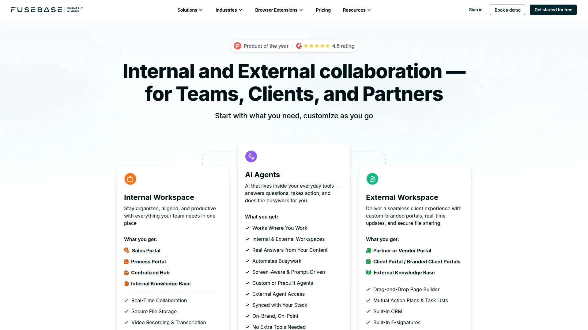

FuseBase merges client-facing sales rooms with internal project workspaces, letting teams manage both external client interactions and internal collaboration from one platform. Deal rooms impress prospects with interactive spaces containing sales materials, contracts, proposals, and tracked engagement analytics. Project portals keep teams and clients aligned with shared documents, task lists, meeting notes, and video recordings.

No-code page builder creates custom portal layouts without developer involvement, using drag-and-drop interfaces and pre-built templates. Built-in CRM tracks deals, contacts, and sales pipelines without requiring separate systems. E-signature functionality handles contract signing directly within portals rather than routing to external services.

**AI capabilities** include real-time answers from your content library, automated busywork, and custom agents that assist with routine tasks. Video recording with transcription captures client meetings and creates searchable archives of important conversations. White-label options and SMTP support maintain brand consistency across all client touchpoints.

Integration with Slack, Microsoft Teams, CRM systems, and email keeps FuseBase connected to your existing tech stack. The platform particularly suits teams blending sales, onboarding, and ongoing client project management where transitions between stages need to flow smoothly.

## **[Flowlu](https://www.flowlu.com)**

Flexible all-in-one CRM with integrated project management and customizable client portals.

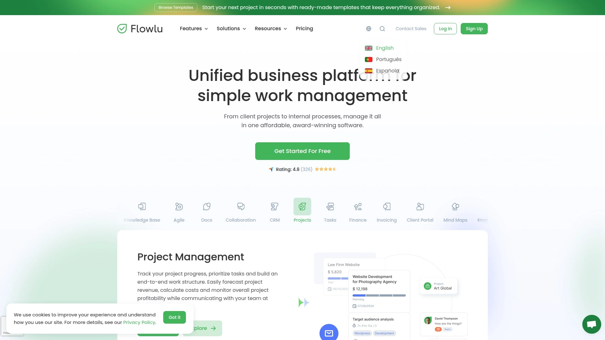

Flowlu combines CRM, project management, financial tools, and client portals within extremely customizable platform that adapts to diverse business models. Create branded client dashboards showing project progress, task statuses, payment history, invoices, and expenses—all tailored to what each client should see. Knowledge base builder lets you create wiki-style documentation with tables, files, images, and videos that clients access for self-service support.

The platform manages entire customer lifecycle from first contact through opportunity pipeline into active projects and ongoing billing. Built-in messenger and comment systems facilitate real-time communication without email or external chat tools. Time tracking captures billable hours that automatically flow into invoices reflecting actual work performed.

**Affordability stands out**—$39 monthly covers teams of up to 8 users with full feature access, making enterprise-style tools accessible to small businesses. 14-day free trial lets teams test comprehensively before committing. Customization depth means you can configure Flowlu to match your specific processes rather than adapting your work to rigid software.

Setup flexibility requires more initial configuration than opinionated tools that enforce specific workflows. Flowlu works best for teams wanting comprehensive business management capabilities at accessible pricing who will invest time in proper configuration.

## **[Clinked](https://www.clinked.com)**

Secure cloud-based collaboration platform emphasizing customization and compliance.

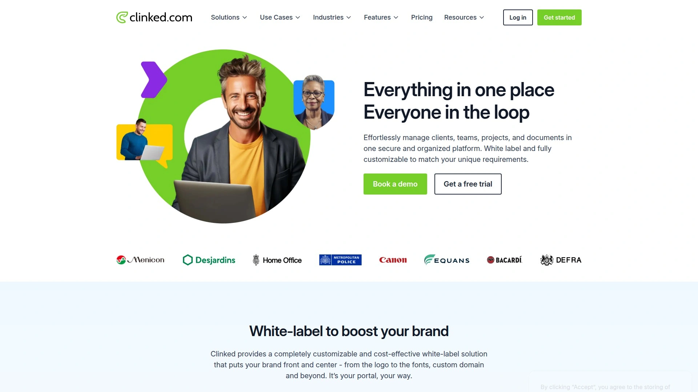

Clinked delivers fully customizable branded client portals with robust file sharing, real-time collaboration, and secure communication tailored to professional services. White-label options let you customize everything—logos, colors, domain names—creating portals that appear as extensions of your own brand. Multiple portal creation manages different clients with separate spaces, each with unique branding, permissions, and content.

Granular access controls set permissions by user role, ensuring clients and team members see only relevant documents and projects. Encryption and compliance features meet requirements for regulated industries like legal, financial services, and healthcare. Real-time notifications alert users to file uploads, task assignments, messages, and project updates without checking the portal constantly.

**Collaboration features** include project tracking, task management, discussion threads, and shared calendars that keep distributed teams coordinated. Mobile and desktop applications provide seamless access regardless of device. Integration with Zapier, Jotform, Typeform, and other tools connects Clinked to broader business processes.

Premium pricing reflects the comprehensive customization and security features—expect higher costs than basic file-sharing tools. Clinked suits businesses prioritizing brand consistency, security compliance, and extensive customization over plug-and-play simplicity.

## **[HoneyBook](https://www.honeybook.com)**

Business management platform for creative professionals with integrated client communication.

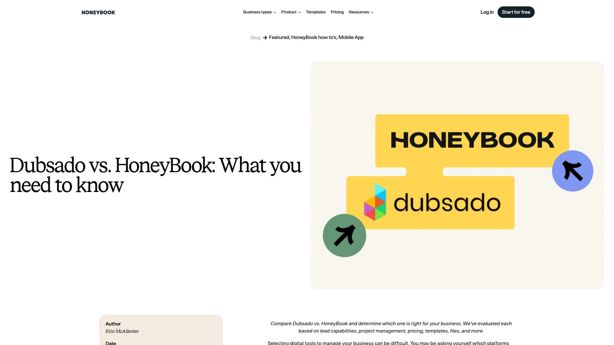

HoneyBook streamlines client management for photographers, event planners, designers, and other creative service providers through unified platform handling leads, contracts, invoices, and communication. Interactive client portal provides friction-free experiences where clients access contracts, files, invoices, and project details with minimal clicks. Clean user interface on both web and mobile ensures clients navigate easily without technical assistance.

Automated workflows send contracts, collect signatures, request payments, and share deliverables based on project milestones or time triggers. Email lead management nurtures prospects through templated sequences that personalize based on inquiry details. Online payment processing integrates directly into invoices, letting clients pay immediately rather than through separate systems.

**Templates and workflows** designed specifically for creative industries reduce setup time compared to configuring general-purpose tools. Scheduling integration coordinates client meetings, shoots, or events with calendar syncing. The platform particularly suits solo creative professionals and small studios managing client relationships without dedicated administrative staff.

Mobile app ensures you can manage bookings, send contracts, or respond to clients from anywhere. HoneyBook works best for creative service businesses where polished client experiences and streamlined administrative tasks matter more than complex project management.

## **[Dubsado](https://www.honeybook.com/blog/dubsado-vs-honeybook)**

Hybrid CRM and client management system with extensive workflow automation.

Dubsado positions as powerful automation-focused platform for service businesses wanting to eliminate repetitive administrative tasks. Customizable forms, contracts, questionnaires, and proposals automatically send based on triggers like inquiry submissions or payment receipt. Client portal provides detailed interaction histories showing every email, contract, invoice, and payment in chronological timeline.

Workflow builder connects triggers to actions without coding—when clients submit forms, Dubsado can automatically send contracts, create projects, schedule tasks, or trigger email sequences. Extensive customization lets you tailor every client-facing element to match your brand and process. The platform supports complex business models with multiple service tiers, add-ons, or package options.

**Automation depth** suits businesses processing numerous similar client engagements where template-based workflows significantly reduce manual work. Invoice and payment features handle estimates, retainers, payment plans, and final billing. The platform particularly benefits established service businesses ready to systematize their operations rather than beginners needing simplicity.

Learning curve reflects the extensive customization options—expect time investment configuring workflows to match your specific processes. Dubsado works best for detail-oriented business owners who value control and automation over out-of-box simplicity.

## **[Hubflo](https://www.hubflo.com)**

Streamlined client operations platform focusing on onboarding automation and customer experience.

Hubflo consolidates client operations with emphasis on onboarding sequences, portal experiences, and customer lifecycle automation. Stunning branded portals impress clients while providing practical access to documents, tasks, communications, and project updates. Onboarding automation guides new clients through information collection, document signing, and initial setup without manual coordination.

Client-facing tools centralize everything customers need—file sharing, secure messaging, task completion, invoice access—within organized interface. Workflow automation triggers actions based on client behaviors like form submissions, document uploads, or payment completion. The platform targets agencies, consultants, and service businesses where first impressions and smooth onboarding directly impact retention.

**Focus on customer experience** differentiates Hubflo from project-management-first tools by optimizing for client perspectives rather than internal team needs. Integration capabilities connect to CRM systems, accounting software, and communication tools your team already uses. Templates and pre-built workflows accelerate setup for common service business patterns.

Hubflo suits businesses identifying client onboarding and ongoing experience as competitive advantages worth investing in specialized tooling. Teams prioritizing client satisfaction metrics over internal project management complexity find the focused feature set appropriate.

## **[Plutio](https://www.plutio.com)**

All-in-one platform for freelancers combining client management with business operations.

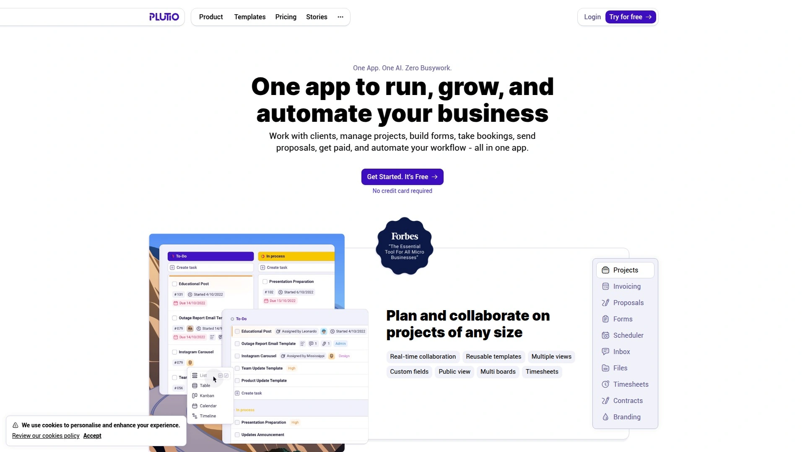

Plutio provides freelancers and small agencies comprehensive business management covering proposals, contracts, invoicing, time tracking, project management, and client communication. The platform particularly suits solo operators managing everything themselves who need affordable all-in-one solution rather than multiple subscriptions. Flexible task management includes multiple project views and assignment options accommodating different work styles.

Client portals give customers branded access to their projects, documents, invoices, and communications. Proposal and contract tools create professional sales documents with integrated e-signatures. Time tracking and billing features log hours that automatically generate invoices reflecting work completed.

**White-label capabilities** let you remove Plutio branding from client-facing areas, presenting everything under your own brand. The platform consolidates tools freelancers typically piece together from multiple services—calendar, forms, contracts, invoicing, file storage, and project tracking. Pricing targets individual professionals and small teams rather than enterprises.

Plutio works best for freelancers and micro-agencies wanting comprehensive business tools without enterprise complexity or pricing. Teams focused on polished client deliverables might find project management less robust than dedicated PM tools.

## **[Airtable](https://www.airtable.com)**

Flexible database platform with powerful project tracking and collaboration capabilities.

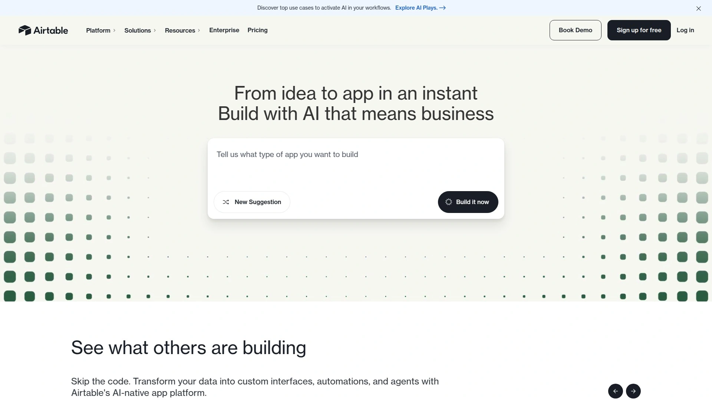

Airtable combines spreadsheet familiarity with database power, creating customizable workspaces for project tracking, client management, and workflow coordination. Multiple views—grid, kanban, calendar, timeline, gallery—let team members visualize data however suits their role. Relational database capabilities link records across tables, maintaining connections between clients, projects, tasks, and deliverables.

Automation workflows trigger actions based on record changes—send notifications, update fields, create linked records—without coding. Rich template library provides starting points for CRM, project management, content calendars, and dozens of other use cases. Powerful filtering and sorting organize large datasets so relevant information surfaces quickly.

**Interface builder** creates custom views for different stakeholders—clients see their projects, executives see dashboards, team members see task lists—all from the same underlying data. Integration with Slack, Google Workspace, Zapier, and hundreds of other tools extends Airtable's capabilities. The platform particularly suits teams needing flexible data organization beyond rigid project management tools.

Airtable requires more initial setup than opinionated tools enforcing specific workflows, though this flexibility rewards investment with precisely-fitted solutions. Teams comfortable with databases and willing to configure custom views find Airtable incredibly powerful.

## **[Monday.com](https://www.monday.com)**

Visual work operating system emphasizing clarity and team collaboration.

Monday.com delivers highly visual project management with customizable boards, automated workflows, and real-time collaboration features. Intuitive interface reduces learning curve compared to complex enterprise tools, getting teams productive quickly. Multiple board views—table, kanban, timeline, calendar, workload—accommodate different work styles and use cases.

Automation builder connects triggers to actions using simple "when this happens, do that" logic—status changes send notifications, deadline approaches assign reminders, tasks complete trigger next steps. Column types include status, people, dates, files, progress tracking, and more, letting you structure boards to match your specific needs. Dashboards aggregate data across multiple boards, providing executives and clients high-level visibility.

**Visual clarity** makes Monday.com particularly accessible to non-technical teams who struggle with spreadsheet-based tools. Real-time updates keep everyone informed as work progresses without status meeting overhead. Integration marketplace connects to popular business tools, ensuring data flows between systems.

Pricing scales with team size and features, making it accessible for small teams while supporting enterprise deployments. Monday.com suits teams prioritizing ease of use and visual clarity over database-style data manipulation.

## FAQ

**How do client portals improve project delivery timelines?**
Client portals centralize communication, file sharing, and approvals in one location clients check regularly, eliminating email delays and version confusion that typically slow projects. Automated notifications prompt clients when action is needed, reducing follow-up burden on your team while keeping momentum.

**What security features should I prioritize in workflow orchestration tools?**
Look for end-to-end encryption, granular access controls, SSO/SAML integration, audit logging, and compliance certifications relevant to your industry like HIPAA or SOC 2. Two-factor authentication and role-based permissions prevent unauthorized access while maintaining usability.

**Can workflow orchestration platforms replace multiple business tools?**
Comprehensive platforms like SuiteDash, Flowlu, and Moxo consolidate CRM, project management, invoicing, file sharing, and client communication into single systems, potentially replacing 5-10 individual subscriptions. Evaluate whether integrated features meet your needs before retiring specialized best-of-breed tools.

## Centralize Your Client Workflows

Workflow orchestration tools transform scattered client interactions into organized processes where communication stays clear, files remain accessible, and progress stays visible to all stakeholders. [Moxo](https://www.moxo.com) excels for organizations managing complex multi-step processes requiring the right balance between automation efficiency and human oversight—particularly professional services, financial institutions, and healthcare providers where compliance and client experience both matter. Choose platforms matching your primary use case whether that's support ticketing, creative project delivery, or regulatory compliance workflows, then configure automation reducing manual coordination that currently consumes team capacity.
